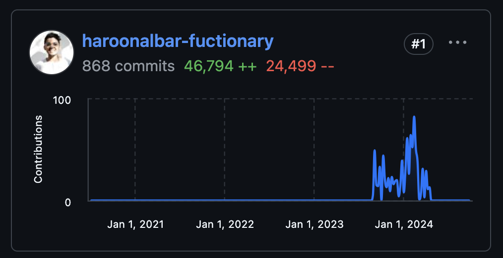
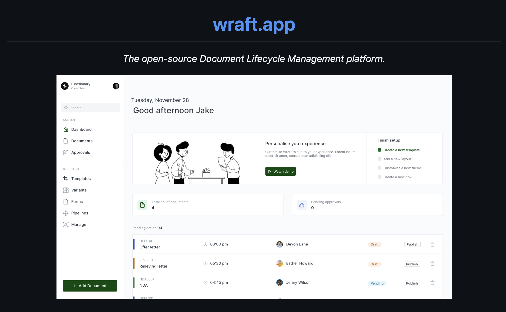

# OSS

<h3 align="center">
  <b>Top contributor</b> of <a href="https://github.com/wraft/wraft-frontend">Wraft Frontend</a> with over 40k lines of code
</h3>

  <a href="https://github.com/wraft/wraft">Wraft</a> is a document lifecycle management platform. 
  I worked on the Frontend for this project.

  
 
   

 

> [!NOTE]
> Just to showcase my previous work.😄
> Can't pin the repo since I contributed from my work GitHub account.
